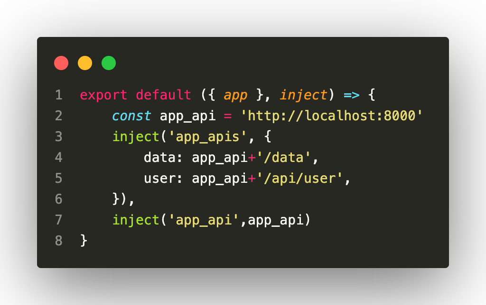

# <div align="center">MARKDOWN Tips and Tricks</div>

### Headings

To create a heading, add number signs (#) in front of a word or phrase. The number of number signs you use should correspond to the heading level. For example, to create a heading level three (`<h3>`), use three number signs (e.g., ### My Header).

```
# H1
## H2
### H3
#### H4
##### H5
###### H6
```

# H1

## H2

### H3

#### H4

##### H5

###### H6

### Lists and Bullets

To make a list, simply add an asterisk before each line item! For numbered lists, you can precede text with numbers instead. To nest your lists, put four spaces at the beginning of each new line of the list.

#### shopping list pt 1

* allen wrenches
* gerbil feeders
* toilet seats
* electric heaters
* Trash compactors
* juice extractor
* shower rods and water meters

***

#### shopping list pt 2

1. Walkie-talkies
2. copper wires safety goggles
3. radial tires

***

#### shopping list pt 3

* Picture hangers
  * paper cutters
    * waffle irons

### Styling Text

You can apply bold, italics, quotes, and strike-through to your text. They can also be used in combination to allow for multiple styles at once. These styles will be ignored if applied to headers.
***Code***

```
**This text is bold.**
*This text is in italics.* _This text is also in italics._
~~This text has a strike-through applied.~~
~~**What if something is really important gets crossed out?**~~
_**It's pretty easy to ~~apply~~ multiple styles.**_
```

**This text is bold.**

*This text is in italics.* _This text is also in italics._

~~This text has a strike-through applied.~~

~~**What if something is really important gets crossed out?**~~

_**It's pretty easy to ~~apply~~ multiple styles.**_

### Quoting Text

Using a greater-than symbol before a line will turn it into a quote. Using multiples of this symbol will nest the quotes further down.

> I body him.

>> There's gonna come a point where you'll forget about what happened and you're gonna wanna come back at me.

>>> Don't get hit

>>>> SERIOUSLY, don't get hit.

>>>>> These keep nesting at 20. I stopped checking after that point.

### Code

When including or quoting code (good for discount codes, lobby codes, or other character specific information), there are two different options.

For inserting a block of codes, you'll need to place three grave characters before and after the desired block. For code in between normal text, just use one on each side.

1. Format by text ` ```code (your text)``` ` or ` ```(your text)``` `

```
6XQS8-KLKEH-FTB
STCBW-2V6V6-9D4
```

2. One line ` `` `` `
``
6XQS8-KLKEH-FTB
STCBW-2V6V6-9D4
``
<br/>
3. The lobby code is `weloveesports`!

### Aligning Text

By default, all text in Markdown fields are aligned to the left. You can also align to the right, or center the content by wrapping the text in div tags. The below code shows both implementations.

#### Text center

<div align="center">The derogatory term “scrub” means several different things. One definition is someone (especially a game player) who is not good at something (especially a game). By this definition, we all start out as scrubs, and there is certainly no shame in that. I mean the term differently, though. A scrub is a player who is handicapped by self-imposed rules that the game knows nothing about. A scrub does not play to win.</div>

#### Text right

<div align="right">Now, everyone begins as a poor player—it takes time to learn a game to get to a point where you know what you’re doing. There is the mistaken notion, though, that by merely continuing to play or “learn” the game, one can become a top player. In reality, the “scrub” has many more mental obstacles to overcome than anything actually going on during the game. The scrub has lost the game even before it starts. He’s lost the game even before deciding which game to play. His problem? He does not play to win.</div>

### Images

In order to insert an image, use the following syntax:

```code

```

Here's an example with the Canada Cup logo!

```code

```

`{src*="#thumbnail"}`

`{title="thumbnail"}`

`{alt="img -thumbnail"}`
<!-- .element height="50%" width="50%" -->


type | *A* | *B*
:---: | :---: | :---:
abc |`{width=200px}`|`{width=300px}`

### Tables

#### 1. The Header

The header of a markdown table consists of two rows. The first row is the column headers for the table. To specify the headers, simply separate each header with spaces and pipes. Make sure to include a pipe at the beginning and end of the line as well.
The second row is just metadata for the table that determines how the text will be vertically aligned. Each column can be aligned left, right, or center. The alignment is set by using a pattern of dashes and a colon separated by spaces and pipes.

```
| Header Column One | Header Column Two | Header Column Three | Header Column Four |
```

To left-align a column, put a colon to the left of two dashes `:--`.
Three dashes `---` can also be used.
To right-align, put a colon to the right of two dashes `--:`.
To center-align, surround a dash with two colons `:-:`.
Surround any of the above with pipes to create the second row of the header.

```
| Default Header | Left Align | Right Align | Center Align |
| --- | :-- | --: | :-: |
```

For better readability of the raw markdown, the number of dashes can be increased.

```
| Default Header | Left Align | Right Align | Center Align |
| -------------- | :--------- | ----------: | :----------: |
```

Spaces can also be used.

```
| Default Header | Left Align | Right Align | Center Align |
| ---            | :--        |         --: |      :-:     |
```

#### 2. The Body

The body of the table consists of any number of rows separated by line breaks. Like the header, every cell is separated by a pipe character `|.` Putting this together with a header creates a full table:

```
| Column 1 Header | Column 2 Header | Column 3 Header |
| --------------- | --------------- | --------------- |
| Row 1 Column 1 | Row 1 Column 2 | Row 1 Column 3 |
| Row 2 Column 1 | Row 2 Column 2 | Row 2 Column 3 |
| Row 3 Column 1 | Row 3 Column 2 | Row 3 Column 3 |
```

When rendered, it will look something like this:
| Column 1 Header | Column 2 Header | Column 3 Header |
| --------------- | --------------- | --------------- |
| Row 1 Column 1 | Row 1 Column 2 | Row 1 Column 3 |
| Row 2 Column 1 | Row 2 Column 2 | Row 2 Column 3 |
| Row 3 Column 1 | Row 3 Column 2 | Row 3 Column 3 |

#### 3. Whitespace

Whitespace before and after the text in a cell does not matter. It will be added or truncated automatically to create columns.

The following tables will both render identically. The only thing to consider here is the readability of the raw markdown file.

```
| Header 1  | Another header here | This is a long header |
| --------  | ------------------- | --------------------- |
| Some data | Some more data      | data                  |
| data      | Some long data here | more data             |
```

```
| Header 1  | Another header here | This is a long header |
| --- | --- | --- |
| Some data | Some more data | data |
| data | Some long data here | more data |
```

#### 4. Empty Cells

The header is the source of truth for the number of columns in the table. If a row in the body contains fewer cells than the header, it will be rendered with empty cells at the end.

Here the first row of the body will be populated with 2 empty cells at the end.

```
| Header 1  | Header 2 | Header 3 |
| --- | --- | --- |
| Some data |
| data | Some long data here | more data |
```

| Header 1  | Header 2 | Header 3 |
| --- | --- | --- |
| Some data |
| data | Some long data here | more data |

If a row in the body contains more cells than the header, the extra cells will be ignored

Here the first row of the body will have 2 cells trimmed from the end.

```
| Header 1  | Header 2            | Header 3  |
| --------- | ------------------- | --------- |
| Some data | Cell 2              | Cell 3    | Ignored | Ignored |
| data      | Some long data here | more data |
```

To add an empty cell in the middle of a row, just leave it empty.

Here the second cell of the first row will be empty.

```
| Header 1  | Header 2            | Header 3  |
| --------- | ------------------- | --------- |
| Some data |                     | Cell 3    |
| data      | Some long data here | more data |
```

This can be done by using whitespace, as above, or without it, as below. They will render identically.

```
| Header 1 | Header 2 | Header 3 |
| --- | --- | --------- |
| Some data | | Cell 3 |
| data | Some long data here | more data |
```

##### Special Characters and Formatting

Within table cells, most markdown formatting syntax—italics, bold, URLs, inline code blocks—can still be used. A literal pipe character can be used by escaping the pipe with a slash as seen below:

```
| This is a single cell containing a \| character |
```

More advanced formatting can be done using HTML tags. Which tags are supported is beyond the scope of this guide, but I will say that the one I use commonly is `<br />` to force cells to span multiple lines.

```
| Header 1  | Header 2 |
| --------  | -------- |
| data      | Some long data that <br /> spans multiple lines |
```

**Note:** Markdown tables will automatically wrap for cells that contain a lot of text. `<br />` is only necessary when you need to force a line break in a specific place.

### Bold

To bold text, add two asterisks or underscores before and after a word or phrase. To bold the middle of a word for emphasis, add two asterisks without spaces around the letters.

```
**bold text**
__bold text__
```

### Italic

To italicize text, add one asterisk or underscore before and after a word or phrase. To italicize the middle of a word for emphasis, add one asterisk without spaces around the letters.

```
*cat's meow*
_cat's meow_
```

Italicized text is the *cat's meow*. ` *cat's meow* `
Italicized text is the _cat's meow_. ` _cat's meow_ `

#### Bold and Italic

To emphasize text with bold and italics at the same time, add three asterisks or underscores before and after a word or phrase. To bold and italicize the middle of a word for emphasis, add three asterisks without spaces around the letters.

```
***really important***
___really important___
__*really important*__
**_really important_**
```

This text is ***really important***.

> #### The quarterly results look great
>
> * Revenue was off the chart.
> * Profits were higher than ever.
>
> *Everything* is going according to **plan**.

* This is the first list item.
* Here's the second list item.

    > A blockquote would look great below the second list item.

* And here's the third list item.

1. Open the file.
2. Find the following code block on line 21:

        <html>
          <head>
            <title>Test</title>
          </head>
        </html>

3. Update the title to match the name of your website.

### Adding Titles

You can optionally add a title for a link. This will appear as a tooltip when the user hovers over the link. To add a title, enclose it in parentheses after the URL.

```
My favorite search engine is [Duck Duck Go](https://duckduckgo.com "The best search engine for privacy").
```

The rendered output looks like this:
My favorite search engine is [Duck Duck Go](https://duckduckgo.com "The best search engine for privacy").

#### URLs and Email Addresses

To quickly turn a URL or email address into a link, enclose it in angle brackets.

```
<https://www.markdownguide.org>
<fake@example.com>
```

The rendered output looks like this:
<https://www.markdownguide.org>
<fake@example.com>

#### Formatting Links

To emphasize links, add asterisks before and after the brackets and parentheses. To denote links as code, add backticks in the brackets.

```
I love supporting the **[EFF](https://eff.org)**.
This is the *[Markdown Guide](https://www.markdownguide.org)*.
See the section on [`code`](#code).
```

The rendered output looks like this:
I love supporting the **[EFF](https://eff.org)**.
This is the *[Markdown Guide](https://www.markdownguide.org)*.
See the section on [`code`](#code).

### Escaping Characters

To display a literal character that would otherwise be used to format text in a Markdown document, add a backslash (`\`) in front of the character.

`\*` Without the backslash, this would be a bullet in an unordered list.
The rendered output looks like this:
\* Without the backslash, this would be a bullet in an unordered list.

Character Name
| Character  | Name |
| --------  | -------- |
| \ | backslash |
| ` | backtick (see also escaping backticks in code) |
| * | asterisk |
| _ | underscore |
| { } | curly braces |
| [ ] | brackets |
| < > | angle brackets |
| ( ) | parentheses |
| # | pound sign |
| * | plus sign |
| * | minus sign (hyphen) |
| . | dot |
| ! | exclamation mark |
| `|` | pipe (see also escaping pipe in tables) |

### Links

If you want text or an image to hyperlink, you'll need to encase the text between brackets, and the intended link directly after, in parentheses.

```code
[This text goes to the smashgg homepage!](http://smash.gg)
```

You can also make images into links! This is useful when you need to link larger versions of displayed images.

```code
<a href="Intended hyperlink"></a>
```

<a href="https://github.com/iphearum">[[GitHub]]</a>

### Tips and Tricks

* Be concise. Short and sweet is usually the best way to convey information.

* Use images and color when possible!

* Keep your content up to date! Users should always be able to go to your page to get relevant and accurate information.

* In the event something doesn't look the way you expect it to, be sure to check for inconsistencies in your markdown!

<style>
h3:hover{
    color:red;
    cursor:pointer
}
img[src*="#thumbnail"] {
   width:150px;
   height:100px;
}
img[alt=thumbnail] {
   width:200px;
}
img[alt$="-thumbnail"]{
    width:300px;
}
img[alt*="=4x6"]{
    width: 400px;
    height: 600px;
}
img[alt*="=6x4"]{
    width: 600px;
    height: 400px;
}
img[alt*="=3x4"]{
    width: 300px;
    height: 400px;
}
img[alt*="=2x4"]{
    width: 200px;
    height: 400px;
}
img[alt*="=2x3"]{
    width: 200px;
    height: 300px;
}
img[alt*="=2x*"]{
    width: 200px;
}
img[alt*="=1x*"]{
    width: 100px;
}
img[alt*="=3x*"]{
    width: 300px;
}
img[alt*="=4x*"]{
    width: 400px;
}
img[alt*="=4x*"]{
    width: 400px;
}
</style>
